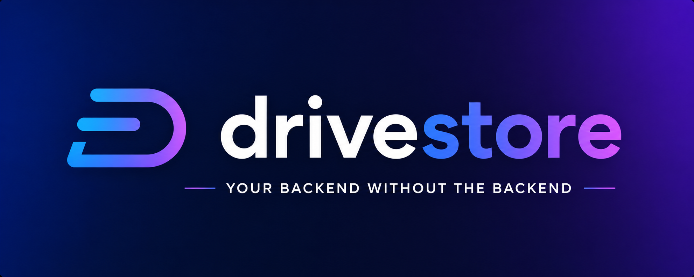

> A tiny, typed TypeScript library that turns Google Drive's **appDataFolder** into a simple path-based file store.

[](https://www.npmjs.com/package/drivestore)
[](./LICENSE)
[](https://www.typescriptlang.org/)

```ts
const store = createDriveStore({ accessToken });

await store.write("config/settings.json", JSON.stringify({ theme: "dark" }));
const settings = await store.read("config/settings.json");
```

---

## Why?

Google Drive's `appDataFolder` is a hidden, per-app storage space that users can't see or accidentally delete. It's perfect for syncing small amounts of app data — preferences, logs, state — across devices without building your own backend.

`drivestore` wraps the Drive REST API in a dead-simple interface: **read, write, append, exists, delete**. No SDKs, no OAuth scaffolding — just bring an access token.

---

## Features

- 📁 **Path-based API** — use familiar `folder/subfolder/file.txt` paths
- 🧱 **Text or binary** — store strings or raw `Uint8Array` bytes; large payloads use resumable upload
- 🗂️ **Auto folder creation** — nested folders are created on demand
- ⚡ **Folder ID caching** — repeated writes to the same directory skip redundant API calls
- 🛡️ **Typed errors** — `DriveError` carries `.status` and `.body` so you can branch on 404 vs 401
- 🔑 **Flexible auth** — pass a static token string or an async function that refreshes it
- 🔁 **Resilient by default** — automatic backoff retries on rate-limit/5xx, one-shot token refresh on `401`
- 🪶 **Zero dependencies** — uses the native `fetch` API (bring your own for Node <18)

---

## Installation

```bash
npm install drivestore
# or
pnpm add drivestore
# or
yarn add drivestore
```

Requires **Node 18+** (or any runtime with `fetch` built in).

---

## Quick start

### 1. Get an access token

You'll need an OAuth 2.0 access token with the `https://www.googleapis.com/auth/drive.appdata` scope. How you obtain it depends on your app:

- **Browser apps** — use [Google Identity Services](https://developers.google.com/identity/oauth2/web/guides/use-token-model)
- **Server apps** — use a service account or the [googleapis](https://github.com/googleapis/google-api-nodejs-client) Node.js client
- **CLIs / local tools** — use `gcloud auth print-access-token` during development

### 2. Create a store

```ts
import { createDriveStore } from "drivestore";

const store = createDriveStore({
  accessToken: "ya29.your-token-here",

  //  namespace all files under this root folder
  rootName: "my-app",
});
```

For long-running processes where tokens expire, pass an async function instead:

```ts
const store = createDriveStore({
  accessToken: () => getAccessToken(), // called before every API request
  rootName: "my-app",
});
```

### 3. Use it

```ts
// Write a file (creates nested folders automatically)
await store.write("users/alice/prefs.json", JSON.stringify({ lang: "en" }));

// Read it back
const raw = await store.read("users/alice/prefs.json");
const prefs = JSON.parse(raw);

// Append to a log
await store.append("logs/2025-01.txt", `${new Date().toISOString()} - login\n`);

// Check existence without throwing
if (await store.exists("users/alice/prefs.json")) {
  // ...
}

// Delete
await store.delete("users/alice/prefs.json");
```

---

## API

### `createDriveStore(options)`

Returns a `DriveStore` instance.

| Option             | Type                              | Default         | Description                                                                        |
| ------------------ | --------------------------------- | --------------- | --------------------------------------------------------------------------------- |
| `accessToken`      | `string \| () => Promise<string>` | —               | **Required.** OAuth token or async supplier.                                      |
| `rootName`         | `string`                          | `"drive-store"` | Name of the root folder in `appDataFolder`. Useful for namespacing multiple apps. |
| `fetch`            | `typeof fetch`                    | global `fetch`  | Custom `fetch` (Node <18 polyfill, proxies, or test mocking).                     |
| `signal`           | `AbortSignal`                     | —               | Abort signal applied to every request.                                            |
| `timeoutMs`        | `number`                          | —               | Per-request timeout in milliseconds.                                              |
| `maxRetries`       | `number`                          | `3`             | Retry attempts for transient failures (`429`/`502`/`503`/`504`). `0` disables.    |
| `retryBaseDelayMs` | `number`                          | `300`           | Base delay for exponential backoff between retries.                               |
| `apiBaseUrl`       | `string`                          | Google Drive v3 | Override the Drive metadata API base URL (advanced / testing).                    |
| `uploadBaseUrl`    | `string`                          | Google upload   | Override the Drive upload API base URL (advanced / testing).                       |

---

### `DriveStore`

All methods accept POSIX-style paths (`"a/b/c.txt"`). Leading/trailing slashes and extra whitespace are ignored.

#### `read(path): Promise<string>`

Returns the file contents as a string. Throws `DriveError` with `status: 404` if the file does not exist.

```ts
const content = await store.read("config.json");
```

#### `write(path, content): Promise<void>`

Creates or fully overwrites a file. Intermediate folders are created automatically.

```ts
await store.write("config.json", JSON.stringify(config));
```

#### `readBytes(path): Promise<Uint8Array>`

Reads a file as raw bytes. Throws `DriveError` with `status: 404` if the file
does not exist.

```ts
const bytes = await store.readBytes("cache/image.png");
```

#### `writeBytes(path, data): Promise<void>`

Creates or fully overwrites a file with raw bytes. Works for any binary payload;
payloads above ~5 MB are uploaded via Drive's resumable protocol automatically.

```ts
await store.writeBytes("cache/image.png", new Uint8Array(buffer));
```

#### `append(path, content): Promise<void>`

Appends `content` to an existing file, or creates it if absent. Intermediate folders are created automatically.

> ⚠️ **Not atomic.** Concurrent calls to `append` on the same file may produce interleaved or lost writes. Serialize access in your application if needed.

```ts
await store.append("events.log", `${Date.now()} clicked\n`);
```

#### `exists(path): Promise<boolean>`

Returns `true` if the file exists, `false` otherwise. Never throws for missing files or folders.

```ts
const hasCache = await store.exists("cache/result.json");
```

#### `delete(path): Promise<void>`

Deletes the file. Throws `DriveError` with `status: 404` if the file does not exist.

```ts
await store.delete("cache/result.json");
```

#### `list(path): Promise<DriveEntry[]>`

Lists the entries directly under a directory. Pass an empty path to list the
store root. Each entry is `{ name, type }` where `type` is `"file"` or
`"directory"`. Throws `DriveError` with `status: 404` if the directory does not
exist.

```ts
const entries = await store.list("logs");
// [{ name: "2025-01.txt", type: "file" }, { name: "archive", type: "directory" }]

for (const entry of entries) {
  if (entry.type === "file") console.log(entry.name);
}
```

---

### `DriveError`

All Drive API failures throw a `DriveError` instead of a generic `Error`, so you can handle specific cases cleanly.

```ts
import { DriveError } from "drivestore";

try {
  const content = await store.read("maybe/missing.txt");
} catch (err) {
  if (err instanceof DriveError && err.status === 404) {
    // file doesn't exist yet — that's fine
  } else {
    throw err; // re-throw unexpected errors
  }
}
```

| Property  | Type     | Description                                          |
| --------- | -------- | ---------------------------------------------------- |
| `message` | `string` | Human-readable description including the HTTP status |
| `status`  | `number` | HTTP status code (`404`, `401`, `403`, …)            |
| `body`    | `string` | Raw response body from the Drive API                 |

---

## Storing binary data & databases

`drivestore` is storage-agnostic — it just persists bytes at a path. How you
produce those bytes is entirely up to you. The text (`read`/`write`) and binary
(`readBytes`/`writeBytes`) APIs are peers; pick whichever fits your data.

A few equally-valid patterns:

```ts
// Direct state — persist whatever you already have
await store.write("settings.json", JSON.stringify(settings));

// A Redux / Zustand / Jotai snapshot — serialize your store however you like
await store.write("state.json", JSON.stringify(serializeStore()));

// Raw binary — images, msgpack, compressed blobs, protobufs, …
await store.writeBytes("assets/logo.png", new Uint8Array(buffer));

// A sql.js database — export to bytes and round-trip them as-is
await store.writeBytes("db/app.sqlite", db.export());
const SQL = await initSqlJs();
const restored = new SQL.Database(await store.readBytes("db/app.sqlite"));
```

The binary API stores bytes verbatim (no base64 inflation), so it suits large
or non-text payloads. sql.js is just one option among many — bring any state or
database layer you prefer.

---

## How it works

All data is stored inside your app's private `appDataFolder` — a special Drive space that:

- Is **invisible** to the user in Drive UI
- Is **scoped to your app** — other apps can't access it
- Is **tied to the user's Google account** — data follows them across devices
- Can be **cleared** by the user via Google Account → Data & Privacy → Delete app data

The folder structure in Drive mirrors the paths you use:

```
appDataFolder/
└── my-app/              ← rootName
    ├── config.json
    └── users/
        └── alice/
            └── prefs.json
```

Folder IDs are cached in memory after the first traversal, so writing `users/alice/a.txt` and `users/alice/b.txt` back-to-back only resolves the `users/alice` chain once.

---

## Running the tests

Tests are written with [Vitest](https://vitest.dev/) and split into unit tests (no network) and integration tests (require a real token).

```bash
# Install dependencies
npm install

# Create a test env file with your token
echo "GOOGLE_ACCESS_TOKEN=ya29.your-token" > .env.test

# Run all tests
npm test

# Run only unit tests (no token needed)
npm test -- --testPathPattern="functions|path"
```

To get a token quickly during development:

```bash
gcloud auth print-access-token
```

---

## Project structure

```
src/
├── types.ts        # DriveFile, DriveError, DriveStore interface
├── drive-api.ts    # Low-level Drive REST wrappers
├── drive-path.ts   # Path utilities and folder resolution
├── drive-store.ts  # createDriveStore factory
├── functions.ts    # Utility functions
└── index.ts        # Public exports

test/
├── auth-permission.test.ts
├── drive-api.test.ts
├── drive-path.test.ts
├── drive-store.test.ts
├── functions.test.ts
├── get-token.ts
└── setup.ts
```

---

## Contributing

Contributions are welcome! Please open an issue before submitting a large pull request so we can discuss the change.

```bash
git clone https://github.com/SomewhatMay/drivestore
cd drive-store
npm install
npm test
```

Please make sure all tests pass and new behaviour is covered by tests before opening a PR.

---

## License

[MIT](./LICENSE) © SomewhatMay
